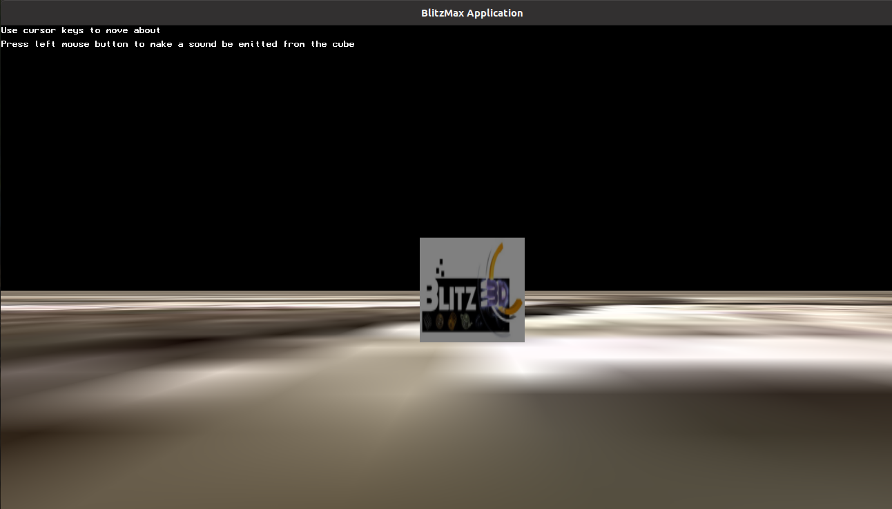
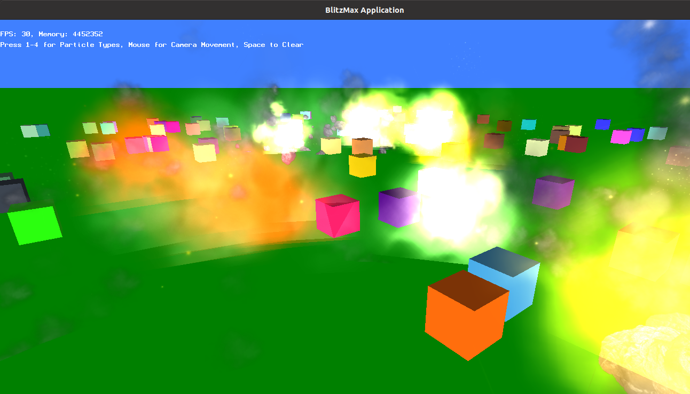

# OpenB3DMax modules
Extra Blitzmax modules for OpenB3D

## Audio3D module
3D positional sound module using Brl.Audio, like Blitz3D but sounds can also be qued, stopped, paused and resumed per entity.

## Particle Candy module
Blitz3D port of Particle Candy, a single-surface particle engine.

## Installation
* Click on the Github Download zip link and extract to your `BlitzMax/mod/` folder.
* Remove **-master** from the main **openb3dmax.mod-master** folder.

